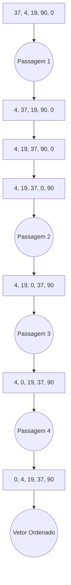

# Algoritmo de Ordenação Bubble Sort

O algoritmo de ordenação Bubble Sort é um algoritmo de ordenação simples que percorre o vetor diversas vezes, comparando elementos adjacentes e trocando-os de posição caso estejam na ordem errada. O algoritmo é chamado de Bubble Sort porque os elementos menores "flutuam" para o início do vetor, assim como as bolhas de ar sobem para a superfície da água.

O algoritmo de ordenação Bubble Sort é um dos algoritmos de ordenação mais simples, com complexidade de tempo médio O(n^2) e complexidade de tempo pior caso O(n^2).

## Funcionamento do Algoritmo

O algoritmo de ordenação Bubble Sort funciona da seguinte maneira:

1. Percorra o vetor da esquerda para a direita.
2. Compare cada elemento com o elemento adjacente.
3. Se o elemento atual for maior que o elemento adjacente, troque-os de posição.
4. Repita os passos 1 a 3 até que nenhum elemento seja trocado em uma passagem.

## Exemplo

Considere o vetor inicial: [37, 4, 19, 90, 0]

