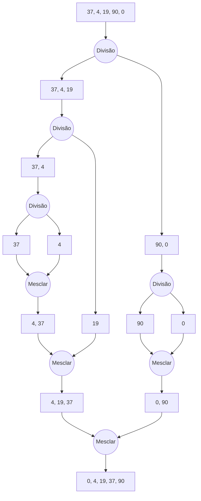

# Algoritmo de Ordenação Merge Sort

O algoritmo de ordenação Merge Sort é um algoritmo de ordenação que utiliza a técnica de divisão e conquista. O algoritmo é baseado na divisão do vetor em subvetores menores, a ordenação desses subvetores e a fusão dos subvetores ordenados para obter o vetor final ordenado. O algoritmo é recursivo, ou seja, ele chama a si mesmo para ordenar os subvetores.

O algoritmo de ordenação Merge Sort é um dos algoritmos de ordenação mais eficientes, com complexidade de tempo médio O(n log n) e complexidade de tempo pior caso O(n log n).

## Funcionamento do Algoritmo

O algoritmo de ordenação Merge Sort funciona da seguinte maneira:

1. Divida o vetor em duas metades.
2. Divida recursivamente as metades em subvetores unitários.
3. Combine os subvetores unitários em subvetores ordenados.
4. Repita o processo de combinação até obter o vetor final ordenado.

## Exemplo

Considere o vetor inicial: [37, 4, 19, 90, 0]

