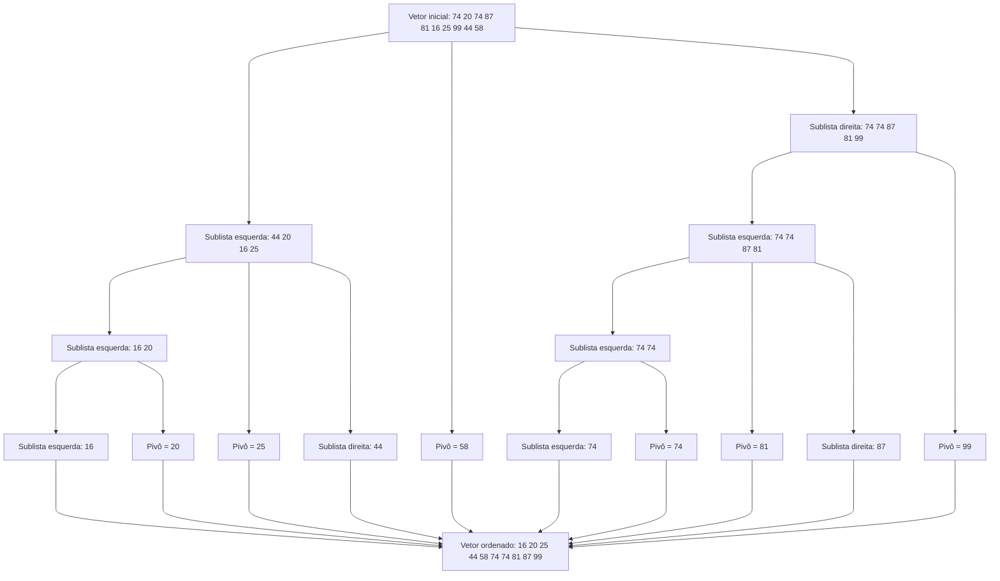
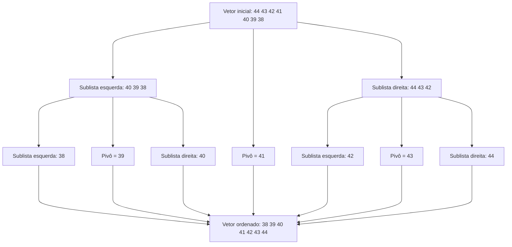
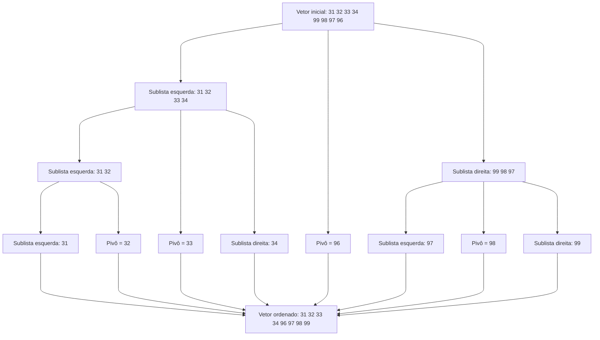

# Algoritmo de Ordenação Quick Sort

O algoritmo de ordenação Quick Sort é um algoritmo de ordenação que utiliza a técnica de divisão e conquista. O algoritmo é baseado na escolha de um elemento do vetor, chamado de pivô, e na divisão do vetor em duas partições, uma contendo os elementos menores que o pivô e outra contendo os elementos maiores que o pivô. O algoritmo é recursivo, ou seja, ele chama a si mesmo para ordenar as partições.

O algoritmo de ordenação Quick Sort é um dos algoritmos de ordenação mais eficientes, com complexidade de tempo médio O(n log n) e complexidade de tempo pior caso O(n^2).

## Funcionamento do Algoritmo

O algoritmo de ordenação Quick Sort funciona da seguinte maneira:

1. Escolha um elemento do vetor como pivô.
2. Divida o vetor em duas partições, uma contendo os elementos menores que o pivô e outra contendo os elementos maiores que o pivô.
3. Ordene recursivamente as partições seguindo os passos 1 e 2.

## Exemplo 1

### selecionando o último elemento como pivô

Considere o vetor inicial: [74 20 74 87 81 16 25 99 44 58]

## Exemplo 2

### selecionando o elemento do meio como pivô

Considere o vetor inicial: [44 43 42 41 40 39 38]

## Exemplo 3

### selecionando a mediana de três como pivô

Considere o vetor inicial: [31 32 33 34 99 98 97 96]

