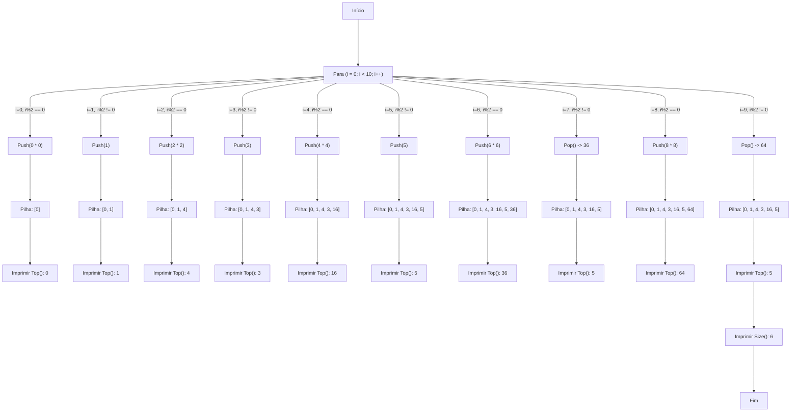

```mermaid
graph TD;
    Start[Início] --> Step1["Cria pilhas: P1 = [40, 30, 25, 10], P2 = [34, 60, 28, 15], P3 = [20, 35], A1 = [], A2 = []"]

    Step1 --> Step2["Remove de P1: 10 e insere em A1"]
    Step2 --> Step3["Remove de P2: 15 e insere em A1"]
    Step3 --> |"P1 = [40, 30, 25], P2 = [34, 60, 28], A1 = [10, 15]"| Step4["Remove de P1: 25 e insere em A1"]
    
    Step4 --> Step5["Remove de P2: 28 e insere em A1"]
    Step5 --> |"P1 = [40, 30], P2 = [34, 60], A1 = [10, 15, 25, 28]"| Step6["Remove de P1: 30 e insere em A1"]

    Step6 --> Step7["Remove de P2: 60 e insere em A1"]
    Step7 --> |"P1 = [40], P2 = [34], A1 = [10, 15, 25, 28, 30, 60]"| Step8["Remove de P1: 40 e insere em A1"]

    Step8 --> Step9["Remove de P2: 34 e insere em A1"]
    Step9 --> |"P1 = [], P2 = [], A1 = [10, 15, 25, 28, 30, 60, 40, 34]"| Step10["Remove de P3: 35 e insere em A1"]

    Step10 --> Step11["Remove de P3: 20 e insere em A1"]
    Step11 --> |"P3 = [], A1 = [10, 15, 25, 28, 30, 60, 40, 34, 35, 20]"| Step12["Remove de A1: 20 e insere em A2"]

    Step12 --> Step13["Remove de A1: 35 e insere em A2"]
    Step13 --> Step14["Remove de A1: 34 e insere em A2"]
    Step14 --> Step15["Remove de A1: 40 e insere em A2"]
    Step15 --> Step16["Remove de A1: 60 e insere em A2"]
    Step16 --> Step17["Remove de A1: 30 e insere em A2"]
    Step17 --> Step18["Remove de A1: 28 e insere em A2"]
    Step18 --> Step19["Remove de A1: 25 e insere em A2"]
    Step19 --> Step20["Remove de A1: 15 e insere em A2"]
    Step20 --> Step21["Remove de A1: 10 e insere em A2"]
    Step21 --> |"A1 = [], A2 = [20, 35, 34, 40, 60, 30, 28, 25, 15, 10]"| Step22["Imprime do topo de A2: 10"]

    Step22 --> Step23["Imprime do topo de A2: 15"]
    Step23 --> Step24["Imprime do topo de A2: 25"]
    Step24 --> Step25["Imprime do topo de A2: 28"]
    Step25 --> |"Console: 10, 15, 25, 28"| Final["Estado Final: P1 = [], P2 = [], P3 = [], A1 = [], A2 = [20, 35, 34, 40, 60, 30]"]
```

# Pilhas

## Introdução

Uma pilha é uma estrutura de dados linear que segue o princípio LIFO (Last In, First Out), ou seja, o último elemento inserido é o primeiro a ser removido. As operações básicas de uma pilha são `push` (inserir um elemento no topo da pilha) e `pop` (remover o elemento do topo da pilha).

## Exemplo 1

Simular o comportamento de pilhas dinâmicas para os algoritmo abaixo:

```
Para (i = 0 ; i < 10 ; i++) {
    Se (i % 2 == 0) {
        Push(i * i);
    } Senão {
        Se (i <= 5) {
            Push(i);
        } Senão {
            Imprimir(Pop());
        }
    }
    Imprimir(Top());
}
Imprimir(Size());
```

### Simulação



## Exemplo 2

Simular o comportamento de pilhas dinâmicas para os algoritmo abaixo:

```
Para (i = 100 ; i < 115 ; i++) {
    Se (isEmpty()) {
        Push(i + 100);
    } Senão {
        Se (Size() <= 4) {
            Push(i + 50);
        } Senão {
            Imprimir(Pop());
        }
    }
    Imprimir(Top());
}
Imprimir(Size());
```

### Simulação



```mermaid
graph TD;
    A0[Início] --> A1["Para (i = 100; i < 115; i++)"]

    A1 --> |"i=100, isEmpty() == true"| B0["Push(100 + 100)"]
    B0 --> C0["Pilha: [200]"]
    C0 --> D0["Imprimir Top(): 200"]

    D0 --> |"i=101, isEmpty() == false, Size() <= 4"| B1["Push(101 + 50)"]
    B1 --> C1["Pilha: [200, 151]"]
    C1 --> D1["Imprimir Top(): 151"]

    D1 --> |"i=102, isEmpty() == false, Size() <= 4"| B2["Push(102 + 50)"]
    B2 --> C2["Pilha: [200, 151, 152]"]
    C2 --> D2["Imprimir Top(): 152"]

    D2 --> |"i=103, isEmpty() == false, Size() <= 4"| B3["Push(103 + 50)"]
    B3 --> C3["Pilha: [200, 151, 152, 153]"]
    C3 --> D3["Imprimir Top(): 153"]

    D3 --> |"i=104, isEmpty() == false, Size() <= 4"| B4["Push(104 + 50)"]
    B4 --> C4["Pilha: [200, 151, 152, 153, 154]"]
    C4 --> D4["Imprimir Top(): 154"]

    D4 --> |"i=105, Size() > 4"| B5["Pop() -> 154"]
    B5 --> C5["Pilha: [200, 151, 152, 153]"]
    C5 --> D5["Imprimir Top(): 153"]

    D5 --> |"i=106, Size() <= 4"| B6["Push(106 + 50)"]
    B6 --> C6["Pilha: [200, 151, 152, 153, 156]"]
    C6 --> D6["Imprimir Top(): 156"]

    D6 --> |"i=107, Size() > 4"| B7["Pop() -> 156"]
    B7 --> C7["Pilha: [200, 151, 152, 153]"]
    C7 --> D7["Imprimir Top(): 153"]

    D7 --> |"i=108, Size() <= 4"| B8["Push(108 + 50)"]
    B8 --> C8["Pilha: [200, 151, 152, 153, 158]"]
    C8 --> D8["Imprimir Top(): 158"]

    D8 --> |"i=109, Size() > 4"| B9["Pop() -> 158"]
    B9 --> C9["Pilha: [200, 151, 152, 153]"]
    C9 --> D9["Imprimir Top(): 153"]

    D9 --> |"i=110, Size() <= 4"| B10["Push(110 + 50)"]
    B10 --> C10["Pilha: [200, 151, 152, 153, 160]"]
    C10 --> D10["Imprimir Top(): 160"]

    D10 --> |"i=111, Size() > 4"| B11["Pop() -> 160"]
    B11 --> C11["Pilha: [200, 151, 152, 153]"]
    C11 --> D11["Imprimir Top(): 153"]

    D11 --> |"i=112, Size() <= 4"| B12["Push(112 + 50)"]
    B12 --> C12["Pilha: [200, 151, 152, 153, 162]"]
    C12 --> D12["Imprimir Top(): 162"]

    D12 --> |"i=113, Size() > 4"| B13["Pop() -> 162"]
    B13 --> C13["Pilha: [200, 151, 152, 153]"]
    C13 --> D13["Imprimir Top(): 153"]

    D13 --> |"i=114, Size() <= 4"| B14["Push(114 + 50)"]
    B14 --> C14["Pilha: [200, 151, 152, 153, 164]"]
    C14 --> D14["Imprimir Top(): 164"]

    D14 --> |"i=115"| E0["Imprimir Size(): 3"]
    E0 --> F[Fim]
```

## Exemplo 3

Considere as pilhas iniciais já criadas e populadas P1 = [40, 30, 25, 10]; P2 = [34, 60,28,15]; P3 = [20, 35]   Admita que um método Java, chamado exibePilha, receba essas três pilhas como parâmetros e
execute os seguintes passos (Fazer como teste de mesa):

1. Cria duas pilhas auxiliares, A1 e A2, inicialmente vazias;
2. Remove um elemento de P1 e o insere em A1. Em seguida, remove um elemento de P2 e o
insere em A1. Repete esses dois procedimentos até que P1 e P2 fiquem, ambas, vazias;
3. Remove um elemento de P3 e o insere em A1. Repete esse procedimento até que P3 fique
vazia;
4. Remove um elemento de A1 e o insere em A2. Repete esse procedimento até que A1 fique
vazia;
5. Remove um elemento de A2 e o exibe no console. Repete esse procedimento 4 vezes.
O que será exibido no console e como ficarão as pilhas, quando o método exibePilha for
executado?

### Simulação

